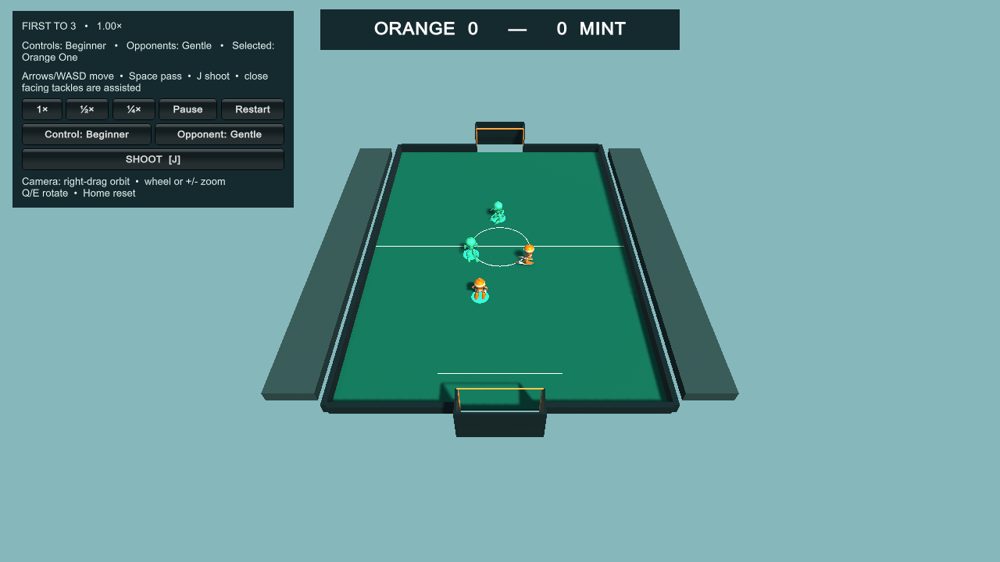
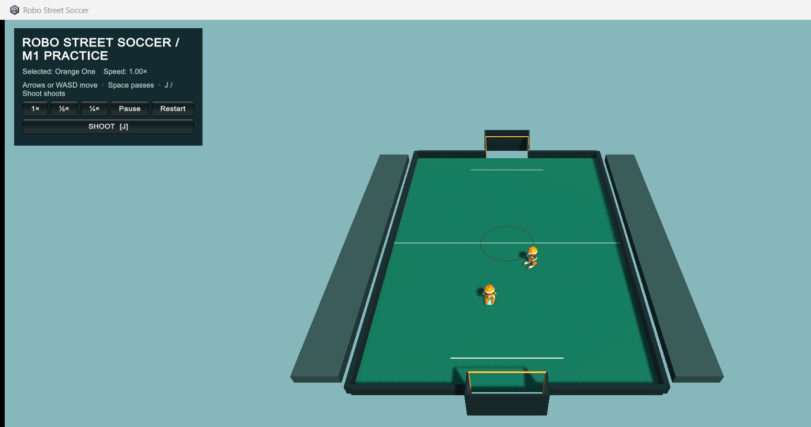
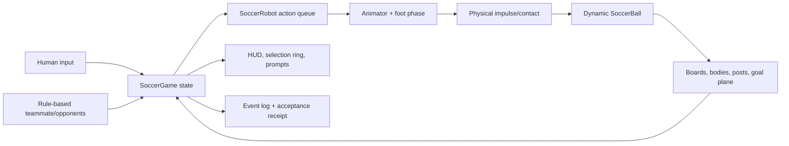
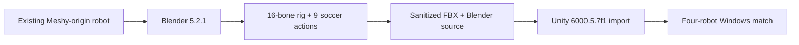
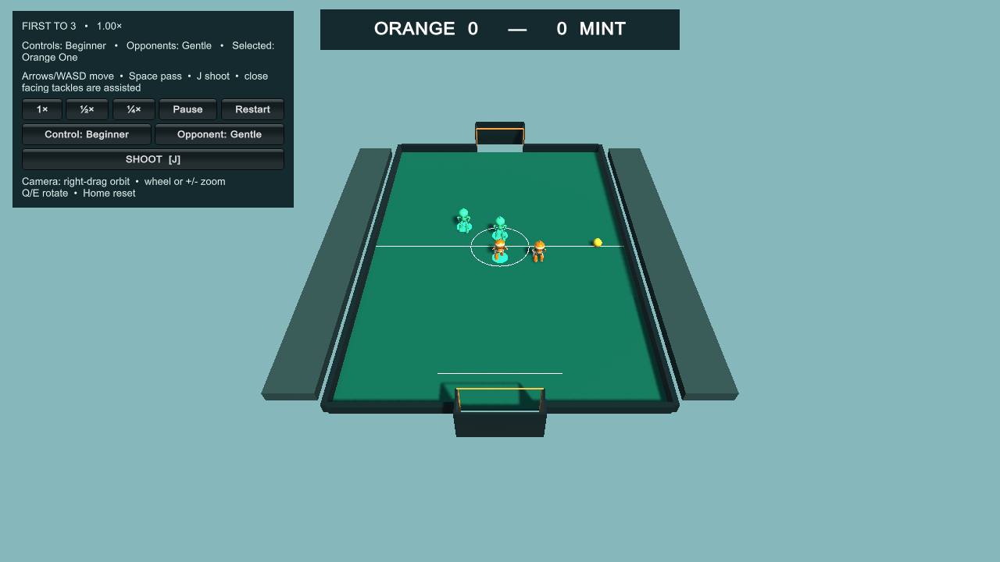

# Development Journey — “Robo Street Soccer” from a voice idea to a public 2v2 game

**Date:** September 6, 2026 (Pacific time; some machine and GitHub records roll into September 7 UTC)  
**Deliverable:** [Robo Street Soccer v0.1.0](https://github.com/az9713/robo-street-soccer/releases/tag/v0.1.0)  
**Source:** [github.com/az9713/robo-street-soccer](https://github.com/az9713/robo-street-soccer)  
**Brief:** “Okay, I want to use the same workflow, instead tennis game, I'm exploring the possibility of turning into a soccer game, but with two players on each side.”  
**Final render/artifact:** `RoboStreetSoccer-v0.1.0-Windows.zip`

> **Evidence key.** **Source** means a statement is supported by the retained conversation, source code, machine-readable receipt, screenshot, or release artifact. **Reconstruction** means the exact live event is no longer independently observable and the account is rebuilt from durable artifacts. **Limit** marks something the evidence does not establish.



*Source — rendered frame from the final four-robot Windows build. It is gameplay output, not a concept image.*

Robo Street Soccer began in a morning voice chat, not in an issue tracker. The human wanted to reuse the development workflow of an earlier robot tennis game while changing the sport to two-on-two soccer. The first obstacle was conceptual: one person could not comfortably steer two robots at once. The answer became the game’s core interaction—control one robot, let a local rule-based teammate move into support, pass, and transfer control only when the teammate physically receives the ball.

The build did not proceed straight from idea to code. The human required a separate project, a written specification, a section-by-section review, a preflight audit, and an implementation plan before authorizing implementation. After the first playable milestone, the human tested the game and changed it in ways no automated acceptance suite had predicted: the ball was too small, the full pitch was not visible, the camera needed orbit, zoom, and a much wider tilt range, and shooting looked possible while silently failing. Those corrections changed the shipped interaction more than any abstract polish pass.

Only then did the human authorize a complete public game and require implementation by less powerful delegated models. GPT-5.6 Sol owned gameplay, GPT-5.6 Terra owned motion and asset sanitation, and GPT-5.6 Luna owned release engineering. A GPT-6 Astra coordinator reviewed their work, found cross-system failures, held publication behind evidence gates, tested the extracted ZIP, and published the final source and release.

This account was assembled from the chronological voice/text sessions and checked against `SPEC.md`, `PROJECT-BRIEF.md`, `IMPLEMENTATION-PLAN.html`, `DEVELOPMENT-LOG.md`, the final source, screenshots, motion review, build receipt, three final match receipts, and package receipt. Raw transcripts, machine usernames, personal paths, credentials, private backups, and local repository history are deliberately absent.

## 1. The brief — make two-player control feel like one coherent action

### 1.1 The voice-chat origin

**Source — morning voice transcript.** The human proposed using the same workflow as the tennis game, “but with two players on each side.” The uncertainty arrived in the next breath: with only one pair of hands, how could one person control two units inside a small time window?

The first design suggestion was deliberately arcade-like:

1. The human steers one robot at a time.
2. A teammate controller moves the second robot into a useful passing lane.
3. Pressing pass does not immediately switch control.
4. Control changes only after the teammate makes a valid physical reception.
5. On defense, the advanced preset can switch manually; beginner play uses assistance.

This solved an input-bandwidth problem rather than simulating every responsibility of real football. The control design compressed a coordinated two-player action into a sequence the human could understand: **move → pass → receive/switch → shoot**.

The human also set the quality bar. The first prototype could remain simple, but it had to look plausible, feel fun, and respect physics and body movement. That sentence put foot-to-ball contact, body blocking, readable motion, and ball response ahead of offside, fouls, keepers, complex tactics, or elaborate aerial play.

### 1.2 The human stopped implementation before it started

**Source — voice and text transcript.** The human requested a new folder and separate soccer task, then said: “when spec is ready, let me know and then we can go for it again before you do anything.” The agent stopped after creating `PROJECT-BRIEF.md` and `SPEC.md`. No game code, asset copy, paid generation, or publication was allowed through that gate.

The specification was reviewed section by section. The human introduced questions that a first-pass design could easily omit:

- What happens when robots collide?
- Should contact block, push, or do both?
- Can the controls be simplified for a non-gamer?
- What happens when the ball hits the posts or crossbar?
- What happens when a ball escapes the rebound boards?
- What “model” drives teammate and opponent AI?
- Is `0.22 m` or `0.11 m` the intended ball radius?

Those were not cosmetic questions. They defined the physical and cognitive contract of the game.

### 1.3 The settled product decisions

| Decision | Options considered | Choice and reason |
|---|---|---|
| Human control | Simultaneous control; fixed single robot; switch-on-pass | **One robot plus pass-and-switch on confirmed reception.** Simultaneous control exceeded the input bandwidth of one player; a fixed robot would make passing feel detached. |
| Team AI | Trained model or language model; rule logic | **Local Unity/C# states and scored actions.** Behavior had to be deterministic, offline, debuggable, and governed by the same physics interfaces as the human. |
| Body contact | Pure blocking; free pushing; blocking with slight pushing | **Blocking with bounded slight pushing.** Head-on contact slows or blocks; glancing contact permits movement; nobody can bulldoze another robot. |
| Controls | One dense gamer preset; one simplified preset | **Beginner default plus Advanced.** Beginner separates pass and shoot and automates dribbling/defensive assistance. Advanced adds manual switching and tackle intent. |
| Difficulty | One opponent style; selectable behavior | **Gentle default plus Balanced.** Difficulty changes local decision timing and pressure, never collision or scoring geometry. |
| Pitch | Outdoor laws; enclosed arcade court | **Small enclosed pitch with live board rebounds.** It keeps play moving and reduces dead time. |
| Out of bounds | Throw-ins/corners/goal kicks; one restart | **One visible kick-in rule.** The non-last-touch team restarts near the exit after opponent clearance. |
| Goal frame | Decorative goal; physical posts and bar | **Solid posts and crossbar.** Rebounds stay live; the whole physical ball must cross the valid mouth. |
| Ball size | Draft ambiguity between radius and diameter | **Physical radius `0.11 m`, diameter `0.22 m`.** The earlier `0.22 m radius` wording was corrected as a radius/diameter error. |
| Match scope | Full football simulation; compact first release | **2 orange vs 2 mint, first to three, no keeper/offside/fouls.** Ground play and contact quality received the time. |

**Rule learned:** if “AI” appears in a game specification, define whether it means a model or a decision system. Here it means a finite-state/scored-action controller. There is no GPT, Claude, trained policy, cloud inference, or player-selectable AI model inside the game.

## 2. Cold start — reuse the tennis production chain without copying the tennis project

### 2.1 What could be reused

The tennis project supplied a working production pattern:

`reference and brief → asset inspection → Blender motion work → Unity integration → Windows build → measured receipts → human playtest`

It also supplied the robot’s visual identity and source assets. Blender inspection found a roughly `1.784 m` character with a 16-bone armature, including hips, thighs, shins, and feet. There were no separate toe bones. That made two-bone leg work and foot rotation plausible, but it ruled out promising precise toe articulation.

The soccer project reused the existing robot geometry and texture lineage. It did **not** clone the tennis Unity project. The preflight found tennis-specific controllers, learning/reporting systems, build artifacts, logs, and private configuration. A fresh Unity project and an explicit asset allowlist kept the sports separated.

**Source — retained M0 receipt and Blender/Unity assets.** The soccer FBX retained 16 bones and 11,813 skinned vertices. Nine actions were authored or adapted for soccer: `Idle`, `Run`, `Turn`, `Dribble`, `Receive`, `Pass`, `Shoot`, `Tackle`, and `ContactLean`.

### 2.2 What each production tool did

| Tool or system | Actual job in this project |
|---|---|
| Voice chat | Captured the control problem, physical-contact questions, beginner needs, and review gate in natural conversation. |
| Claude `/dev-journey` skill | Supplied the “warts and all” documentation method used for this account. It did not build the game. |
| Unity 6000.5.7f1 | Runtime, rendering, C# behavior, PhysX rigid bodies, input, camera, UI, scenes, Windows builds, and acceptance runner. |
| Blender 5.2.1 LTS | Inspected the reused 16-bone robot, authored/exported nine soccer actions, and verified the sanitized FBX round trip. |
| Meshy | Origin of the reusable robot asset in the earlier tennis workflow. **No new Meshy generation or credits were spent on soccer.** |
| PowerShell | Drove repeatable builds, clean source export, portable ZIP packaging, SHA-256 checks, and fail-closed release tests. |
| Git and GitHub CLI | Created the clean public repository and v0.1.0 release after verification. Local development history was not published. |
| JSON receipts | Recorded fixed-step gameplay events and measurable acceptance results at 1×, ½×, and ¼×. |
| PNG captures | Supplied visual checkpoints for four-player play, reception, shooting, and tackling. |

The initial preflight verified Unity and Blender installations, Windows support, available disk space, and the recovered robot assets. It also separated install presence from fitness for use: a file can exist while the rig, scale, deformation, or runtime import remains unproven.

### 2.3 Four preflight gaps were closed in the plan

The audit found four implementation-contract gaps:

1. Start a clean Unity URP project and copy only approved assets.
2. Keep tackle gameplay in the later two-on-two phase, even though its animation could be authored during M0.
3. Use a constant `0.01 s` physics step at every playback speed. Slow motion changes wall-clock playback, not simulation contact rules.
4. Make M1 quantitative: direct pass and reception, no false control transfer, no live-play ball teleport, stance drift at most `3 cm`, contact gap target at most `5 cm`, several pass geometries, and a mandatory human feel/readability checkpoint.

The implementation plan turned those into milestones M0–M3 and explicit go/no-go gates. A separate PRD was rejected because the brief, specification, and implementation plan already covered product goal, behavior, and execution. More process documentation would have repeated decisions without reducing risk.

### 2.4 The first engine failure happened before gameplay code

Unity’s command-line `-createProject` produced partial cache folders but no `Packages/manifest.json`. The retained exact error was:

```text
Failed to update project manifest: The "path" argument must be of type string. Received undefined
```

Unity exited with code 1. The fix was to remove only the incomplete generated cache, write the minimal project manifest and version explicitly, then let Unity open/import the project normally in batch mode.

Package resolution then failed because the command process lacked `ALLUSERSPROFILE`. Supplying the standard system value for that process allowed package resolution and the first full import to complete. No system-wide setting had to change.

**Rule learned:** create-project success is proved by a resolvable manifest and a clean import, not by the existence of a new directory.

## 3. Design decisions — physical truth, visual readability, and bounded assistance

### 3.1 The ball stayed physical

The authoritative ball is a Unity rigid body with approximately `0.11 m` physical radius, `0.43 kg` mass, gravity, rolling resistance, and continuous collision detection. Possession is logical permission to attempt an action; it is not parenting the ball to a robot. Dribbles, passes, receives, shots, and tackles apply bounded impulses at contact phases.

Pass logic selects the teammate, predicts a modest reception lead, and waits for the striking foot. Human selection stays with the passer during flight. The receiver earns control only after actual contact and a bounded post-cushion speed. A miss, wall rebound, or interception cannot silently switch the player.

Shooting follows the same one-impulse rule but later gained bounded assistance. The visible shell became intentionally much larger than the physical collider after human testing. The shot reach may use that rendered boundary so the game behaves as it looks, while dribble/pass/receive collision evidence continues to use the true physical geometry.

### 3.2 The pitch and goals were part of the physics system

The pitch is approximately `18 × 26 m`, enclosed by low boards. A normal board rebound stays live. A complete-ball escape outside a scored goal enters a dead-ball state, remembers last touch and exit location, awards the other team a kick-in, provides clearance, and resumes only on kick contact.

Posts and crossbar are colliders rather than decoration. A goal counts only when the complete physical ball crosses the plane inside the posts and below the bar. A latch prevents duplicate goals until an explicit reset. Behind-goal boundaries sit beyond the scoring plane so they cannot stop a valid crossing.

### 3.3 Body contact was symmetrical

Robots use the same solid-body rules on both teams. Head-on contact slows or blocks with small displacement. Glancing contact can brush past. A bump may disturb a dribble through the ball’s physics, but it never assigns possession. Robots remain upright; visual lean and recovery convey impact without a ragdoll or fall system.

### 3.4 “Gentle” and “Beginner” solved different problems

This distinction almost disappeared in ordinary UI language:

- **Beginner / Advanced** changes human input and assistance.
- **Gentle / Balanced** changes rule-based opponent decision timing, spacing, aim, and pressure.
- Neither setting changes the fixed step, ball collider, physical contact validity, or scoring geometry.

Gentle and Beginner ship as defaults because the human explicitly asked for a public game that is user-friendly and fun within the physics constraints.

### 3.5 Deliberate cuts

The game does not implement online multiplayer, goalkeepers, offside, fouls, throw-ins versus corners versus goal kicks, trained-model selection, persistent learning, high crosses, headers, bicycle kicks, sliding tackles, deforming nets, or full football simulation. These were conscious scope cuts. They kept the project focused on a readable four-robot match and a defensible physical-contact chain.

## 4. The core problem — automated success did not mean the human could enjoy the game

M1’s acceptance runner passed a complete dribble → pass → receive → control-transfer → shot chain at all three speeds. Body-contact tests also passed. The human then played it and immediately found problems the receipts did not cover.

That contrast is the central lesson of the build: **tests proved the implementation’s contract; playtesting challenged whether the contract was the right one.**

### 4.1 M1 versus the released match

| Dimension | Early M1 practice build | Final v0.1.0 release |
|---|---|---|
| Roster | One controlled orange robot and one orange teammate | Two orange robots versus two mint robots |
| Objective | Prove dribble → pass → receive → shoot | First-to-three complete match with goals, restarts, tackles, and AI play |
| Human controls | Beginner movement, pass, shoot | Beginner and Advanced selectable; Beginner default |
| Opponent difficulty | No opponents | Gentle and Balanced selectable; Gentle default |
| Camera | Fixed view, then manually revised | Full-court default, orbit, zoom, reset, and `10°–85°` tilt |
| Ball rendering | Regulation-scale visual at first | Deliberately oversized `0.33 m` visual radius with `0.11 m` physical radius |
| Shoot input | Narrow pose/reach/facing gate | Buffered, interruptible, bounded approach; final `1.25 s` simulation-time queue |
| Evidence | Isolated chain and body-contact suites | Four-robot fixtures, 60 simulated seconds of free play, edge cases, package reruns |
| Publication | Local approval build | Clean public source plus verified Windows ZIP |

### 4.2 “The ball needs to be bigger”

**Source — human playtest.** The original ball was `0.22 m` across at full-pitch scale. It was physically plausible and hard to see.

The first change tried a `33 cm` diameter ball and raised its spawn so it sat correctly. Enlarging the collider as well as the mesh caused a regression: the automated pass still completed, but the shot sequence failed. That experiment was rejected. The implementation kept the proven contact footprint and enlarged only the rendered shell.

The human then asked to “try doubling the radius again.” The visible radius increased from `0.165 m` to `0.33 m`, creating a `0.66 m` rendered ball. The physical radius remained `0.11 m`. The result is intentionally not a regulation-scale rendering.

This creates a real interface tension: foot/ball collision truth uses the small physical sphere, while human expectation follows the large visible sphere. The later shooting assist was designed specifically to reconcile those two boundaries without changing pass, receive, and dribble physics.

**Rule learned:** physical realism can reduce legibility. Preserve the simulation’s truth, then make the visual/control contract explicit where readability requires exaggeration.

### 4.3 “The entire court should be visible”

The human supplied a screenshot showing the near end line and south goal below the frame. The first camera revision moved back and widened the field of view. Its verification image still left the near goal touching the bottom edge. A second revision shifted the framing toward the near half and added margin until both goals, every boundary, and both side boards fit the same window shape.



*Source — M1 camera receipt image. The first framing attempt was rejected before this accepted view.*

The human then asked whether the entire scene could rotate and zoom. The game gained right-drag orbit, mouse-wheel and `+`/`−` zoom, `Q`/`E` horizontal orbit, and `Home` reset.

When asked about tilting, the first answer pointed out an existing `25°–70°` vertical range. The human wanted more. The range expanded to **`10°–85°`**, spanning a low sideline perspective and an almost vertical overhead view.

This was not decoration. A four-player passing game requires spatial awareness. Camera agency became a gameplay feature because the human could see occlusion and framing failures that scripted contact tests could not.

### 4.4 “It is very difficult for the robot to kick the ball”

The human described the consequence clearly: solving the kick problem would make the game much more enjoyable.

Source inspection found three stacked rejection gates:

1. The rendered ball looked reachable while the much smaller physical contact radius said it was not.
2. Shooting required precise alignment to the right foot and the goal.
3. A press during automatic dribbling was discarded.

The first human-playability fix buffered `J` for `0.75 s`, allowed shooting to interrupt dribbling, turned the robot toward the ball, and applied a bounded short approach during wind-up. The final autonomous phase strengthened that contract: the release uses a **`1.25 s` queue measured with scaled simulation time**. A quarter-speed test sends one shot request while reception is completing. It may not pass by repeatedly injecting the input.

Shooting now uses the visible ball boundary for bounded reach assistance. The ball still receives one physical impulse at the authored contact phase. The motion report explicitly records that this is visual-boundary assistance, not a claim that every shot meets the stricter `5 cm` physical proxy target.

### 4.5 Human contribution, precisely

The human did not model the robot, author C#, tune colliders, write release scripts, or edit the Blender actions. The human’s contribution was equally load-bearing:

- Proposed adapting the tennis workflow to two-on-two soccer.
- Identified the impossible-feeling simultaneous control problem.
- Selected pass-and-switch with an AI teammate.
- Set plausible motion, physics, and fun as the quality bar.
- Required a separate folder, specification, review, preflight, and implementation plan.
- Selected blocking with slight pushing.
- Selected Beginner as default and retained Advanced.
- Required physical goal bars and a simple kick-in.
- Resolved the ball-unit ambiguity at `0.11 m` physical radius.
- Played M1 and requested a larger ball, complete-court framing, orbit/zoom, wider tilt, and easier kicking.
- Authorized Gentle and Balanced with Gentle default.
- Authorized public release and autonomous completion.
- Required implementation and this journey to be delegated to less powerful models.

The automated system discovered implementation failures. The human discovered usability failures. Both forms of evidence were necessary.

## 5. Architecture and agents — how the pieces and people divided the work

### 5.1 Runtime architecture



`SoccerGame` owns match state, goals, restarts, last touch, presets, and difficulty. `SoccerRobot` owns movement, queued actions, physical foot checks, animation timing, and selection. `SoccerAgentAI` chooses bounded support, pressure, cover, receive, loose-ball recovery, pass, shoot, and tackle actions. `SoccerBall` owns rigid-body behavior and touch information. `SoccerCameraController` owns framing, orbit, zoom, tilt, and reset. `SoccerAcceptanceRunner` drives fixed-step scenarios and emits JSON.

The AI controllers call the same pass, shoot, tackle, movement, and physics interfaces used by the human. Gentle and Balanced alter decisions inside the local controller. They do not bypass action phases or physics.

### 5.2 Asset pipeline



Meshy’s role belongs to the prior tennis asset history. Soccer reused the asset, inspected it, and authored soccer motion around it. No new Meshy request, generation spend, or model variant was needed. The total cost of Codex/Claude model inference was not recorded, so this document does not invent one.

### 5.3 Final delegated team

**Source — agent dispatch records and final coordinator report.** After the human required lower-model delegation, the final work was split as follows:

| Agent | Model | Ownership | Important contribution |
|---|---|---|---|
| `soccer_gameplay` | GPT-5.6 Sol, high reasoning | Four-robot gameplay, AI, controls, match flow, acceptance | Extended M1 into full 2v2; fixed reception, kick-ins, loose-ball behavior, input timing, corner recovery, and three-speed fixtures. |
| `soccer_motion` | GPT-5.6 Terra, high reasoning | Blender/FBX, motion review, foot planting, public-safe assets | Reused and validated nine actions; scrubbed embedded paths; introduced foot-plant correction and measured action residuals. |
| `soccer_release` | GPT-5.6 Luna, high reasoning | Documentation, source export, ZIP packaging, privacy/integrity gates | Built fail-closed packaging, exact-hash binding, sanitized source snapshot, release docs, and synthetic regression tests. |
| Root coordinator | GPT-6 Astra | Scope, cross-agent review, integration decisions, verification, publication | Inspected outputs, found missed edge cases, rejected regressions, held release gates, tested the extracted ZIP, and published v0.1.0. |

The earlier specification and M1 practice implementation ran in a separate GPT-6 Astra soccer task. This development-journey draft was deliberately delegated to a GPT-5.6 Sol worker and reviewed by the root coordinator, following the human’s instruction.

Delegation was not three isolated branches thrown over a wall. All workers shared the project, so ownership boundaries mattered. Gameplay did not rewrite the release system; release did not invent passing behavior; motion did not publish unverified claims. The coordinator reconciled overlapping evidence and sent targeted corrections back to the appropriate owner.

## 6. What went wrong — symptoms, fixes, near-misses, and fragility

### 6.1 Clean Unity creation failed

**Symptom:** partial project folders, missing package manifest, exit code 1.  
**Exact retained error:** `Failed to update project manifest: The "path" argument must be of type string. Received undefined`  
**Fix:** define the minimal manifest/version explicitly, set the missing process environment needed by package resolution, and perform a normal batch import.

### 6.2 Standalone serialization lost essential references

**Symptom:** the first player could not kick because game, animator, selection-ring, and foot references created during setup did not survive into the standalone runtime. The gate rejected actions rather than manufacturing contact.  
**Fix:** serialize the scene references and initialize them again at player startup.

### 6.3 Automatic dribbling starved the pass input

**Symptom:** the dribble animation restarted immediately, leaving no deterministic pass window.  
**Fix:** add an action cooldown/window and later buffer pass intent through the gather step.

### 6.4 Pass prediction became stale during wind-up

**Symptom:** a moving passer stopped, and the receiver lead was calculated before the strike. The pass aimed at where the play used to be.  
**Fix:** preserve approach speed and calculate the foot-side lead at the contact frame.

### 6.5 Reception used the wrong velocity

**Symptom:** the first “successful” catch happened only after board rebounds because timing used absolute ball speed while ball and receiver moved in the same direction.  
**Fix:** use relative closing velocity, hold the receive pose through a bounded contact window, and confirm reception on the fixed step after cushion impulse resolution.

### 6.6 A goal reset nearly created a false passing success

**Near-miss:** the ball could miss the direct receive, eventually enter a goal, reset, and let the original player shoot. A loose harness could call that a completed chain.  
**Fix:** reject any chain interrupted by a goal, reset, out-of-bounds event, or pre-reception wall rebound.

### 6.7 The test driver was frame-rate sensitive

**Symptom:** scripted inputs ran during display updates. Under concurrent load, identical physics steps received commands at different times.  
**Fix:** move the driver to the authoritative fixed `100 Hz` clock and give it explicit script execution order.

### 6.8 Enlarging the physical ball broke shooting

**Symptom:** the first full-physics size increase kept the pass working but disrupted the follow-up shot.  
**Fix:** preserve the `0.11 m` collider and enlarge the rendered shell. Later shooting alone received bounded visual-boundary reach assistance.

### 6.9 The first “full court” camera was still not full enough

**Symptom:** after moving back and widening the field of view, the near goal still touched the bottom edge.  
**Fix:** shift the view toward the near half and add margin; verify at the human’s window shape before accepting it.

### 6.10 Automated shooting passed while human shooting felt broken

**Symptom:** the visible ball looked reachable, but exact right-foot alignment, goal facing, and an active dribble state silently rejected the input.  
**Fix:** buffer the request, allow it to interrupt dribbling, turn/approach within bounds, use the visible boundary for shot reach, and keep one impulse at the contact phase. The buffer evolved from `0.75 s` in M1 tuning to `1.25 s` of simulation time in the final build.

### 6.11 Public asset review found embedded local paths

**Symptom:** the exported robot and later compiler metadata contained local development paths. Publishing the existing local Git history could also reveal earlier private state.  
**Fix:** sanitize the Blender/FBX assets, re-import and verify all nine takes, configure the final compiler metadata, scan the clean export, and publish a new allowlisted snapshot rather than local history.

### 6.12 Goal and pass edge cases survived the first implementation

**Symptom:** a shot above the crossbar could be classified incorrectly, and an intercepted pass could leave a receiver pursuing a stale target.  
**Fix:** separate goal-mouth geometry from escape/kick-in handling and cancel a targeted receive after interception.

### 6.13 The first final-match reception fixture failed

**Symptom:** test controls were overwritten by ordinary player input. Later traces showed the pass missing the receiving foot, Mint intercepting it, and the support teammate sometimes chasing a ball already controlled by the human.  
**Fix:** separate test control, restore the predictor, keep the support robot in a passing lane, eliminate conflicting receiver commands, and instrument ball speed, receiver position, and animation timing.

### 6.14 Moving-body collision deflected backward passes

**Symptom:** the carrier’s body could touch a backward-directed kick and bend its trajectory away from the receiver.  
**Fix:** change teammate support position and validate trajectory after contact, not just the presence of a pass event.

### 6.15 The kick-in test invalidated itself

**Symptom:** the fixture repeatedly reset the ball before it could leave the pitch; another setup placed the kicking robot against the board.  
**Fix:** permit an uninterrupted exit, move the restart farther inside, and test all eight team/side boundary cases.

### 6.16 Foot planting and passing fought each other

**Symptom:** motion review found visible foot sliding. Slowing the body enough to pass the stance-drift threshold broke moving passes. A stopped passer then watched the rolling ball move about `1.49 m` beyond reach before the kick frame.  
**Fix:** reject the simplistic slowdown, gather the ball physically, buffer pass intent through preparation, brake through the planted step, then predict arrival at the receiver’s foot. The final maximum residual stance drift was below the `3 cm` target.

### 6.17 UI inspection caught visible shipping defects

**Symptom:** Mint’s name clipped in the score strip and one control hint described old behavior.  
**Fix:** correct the HUD before capturing release screenshots.

### 6.18 Short drills hid long-play AI problems

**Symptom:** the 60-second exhibition exposed repeated tackle attempts around a loose ball and later a crowd jam near a board.  
**Fix:** distinguish loose-ball collection from tackling, assign one stable nearest collector, and make other robots create space or cover.

### 6.19 A bounded event list threatened the report

**Near-miss:** older events could be discarded during a long test, distorting totals while the latest portion still looked healthy.  
**Fix:** separate acceptance accounting from the game’s bounded diagnostic log.

### 6.20 Goal restart retained old foot anchors

**Symptom:** after a goal, a planted foot remembered its old world position and produced false drift.  
**Fix:** clear anchors during explicit restart while retaining measurements already collected for the completed phase.

### 6.21 A real-time input buffer failed at quarter speed

**Near-miss:** the test kept reissuing shoot, masking that one human press could expire during a slow reception.  
**Fix:** measure the final `1.25 s` queue in scaled simulation time and make the test send exactly one request.

### 6.22 Gentle mode was under-tested

**Symptom:** a mostly Balanced verification looked active, while the actual default Gentle mode stalled with too little attacking play. A ball could become pinned where two boards met.  
**Fix:** run the full exhibition in Gentle, add physical bounce-out behavior, and retain a separately logged neutral referee reset only for a ball that remains trapped. An intermediate visible run recovered without the fallback, but the frozen final receipts supersede it: each 60-second Gentle exhibition records one neutral `corner_trap_recovered` event after approximately four stuck seconds.

### 6.23 Background captures overwrote overview images with black frames

**Symptom:** close-ups were valid, but concurrent background runs replaced some overview screenshots with black frames.  
**Fix:** recapture rendered overview images, validate resolution and black-pixel content, and include only the four checked frames referenced by the README.

### 6.24 Release packaging had to fail closed

The release worker repeatedly kept production packaging blocked while any of these were missing or wrong:

- The Unity data directory.
- Exactly three passing final match receipts for `1.00`, `0.50`, and `0.25`.
- A successful build receipt.
- Matching executable and `Assembly-CSharp.dll` SHA-256 hashes.
- A deterministic manifest for the shipped runtime payload.
- Clean private-path scans.
- Valid, non-black, supported-resolution screenshots.

Synthetic tests deliberately exercised those failures. The scripts preserved vendor binaries byte-for-byte and created no partial production release when a gate failed.

**Rule learned:** a release pipeline proves its value when it refuses a plausible-looking but unverified package.

## 7. Verification — what “passed” means, and what it cannot mean

### 7.1 M1 evidence

The original practice chain passed at 1×, ½×, and ¼× on the fixed-step runner. Its identical simulation-time events were pass release at `2.35 s`, reception/control transfer at `2.76 s`, and shot at `4.00 s`. Pass and receive gaps were `0 cm`; the shot gap was about `2.41 cm`. Separate body-contact fixtures recorded six head-on and two glancing events with zero sustained midpoint drift and zero root tilt.

That evidence showed that one designed chain was physically and temporally consistent. It did not show that the ball was readable, the camera useful, or kicking enjoyable. The human’s playtest disproved any broader interpretation.

### 7.2 Final build receipts

All three final receipts report `passed: true`, an empty failure string, four robots, Beginner and Gentle as defaults, Advanced and Balanced as selectable, and a fixed step of approximately `0.01 s`.

| Receipt | Speed | Pass received | Shot contacts | Tackle contacts | Body contacts | Goals | Kick-ins awarded / started | Maximum residual stance drift |
|---|---:|---:|---:|---:|---:|---:|---:|---:|
| `match-acceptance-1.00.json` | 1× | 1 | 2 | 9 | 166 | 4 | 9 / 8 | `0.02089 m` |
| `match-acceptance-0.50.json` | ½× | 1 | 2 | 9 | 142 | 4 | 9 / 8 | `0.02129 m` |
| `match-acceptance-0.25.json` | ¼× | 1 | 2 | 9 | 142 | 4 | 9 / 8 | `0.02129 m` |

The 1× receipt records the scripted chain’s queued pass at `2.77 s`, release at `3.31 s`, physical reception at `4.74 s`, buffered shot request at `5.24 s`, and shot contact at `5.88 s`. It also includes 60 simulated seconds of Gentle free play, goal-plane edge checks, all-side kick-in fixtures, action events, and stance measurements.


*Source — representative reception frame from the verified final build.*


*Source — representative shot frame. The shot’s visible-boundary assistance is disclosed in the motion review.*



*Source — representative standing-tackle frame. A tackle is credited through the configured foot-contact proxy, not body proximity.*

### 7.3 Motion evidence and its limit

The motion review combines Blender source inspection with final standalone receipts. It confirms all nine named actions, four configured foot-plant components, and measured residuals below `3 cm`.

It also records a crucial limitation: the foot-gap measurement is a gameplay proxy—a forward segment and radius—not the animated mesh surface itself. The largest credited physical shot-proxy gap is about `6.849 cm`, while its visible gap is zero because the shooting assist uses the large rendered boundary. The close captures corroborate the runtime receipts; they are not a frame-by-frame audit of every free-play action.

### 7.4 Build and package identity

The final Unity build receipt records zero errors and zero warnings. The release receipt binds the ZIP to the exact source executable, gameplay assembly, build evidence, acceptance evidence, and deterministic runtime manifest.

| Artifact | Verified value |
|---|---|
| ZIP | `RoboStreetSoccer-v0.1.0-Windows.zip` |
| ZIP size | `42,032,089 bytes` |
| ZIP SHA-256 | `af27b8b906748c54d406f4e5f116accf56ba51eb175953879b9eebd5a20f1846` |
| EXE SHA-256 | `d05c5848f7cc2eb32ff6016f54762ee3c666a69b862be297df2390830c1ea8cf` |
| `Assembly-CSharp.dll` SHA-256 | `b64f219a5b5be30e270d714d41512c9719e09df80c4cb8eb87bb69bdd50ea8b5` |
| Runtime manifest SHA-256 | `bf30f9d0ccba6e44a511c5b6b3d44990f9ebdecd5da6e6cf2d96298b284fad9c` |
| Public source commit at release | `89a1a4a` |

The three all-speed acceptance runs above were executed from the final build folder. They were not three independent extracted-ZIP runs. After packaging, the coordinator extracted the production ZIP into a fresh directory, verified the packaged file hashes against the release receipt, and captured a completed `package-verification-1.00.json` from the extracted **1×** game. That package receipt confirms four robots, defaults/selectable modes, physical pass reception, shots, tackles, body contact, goals, kick-ins, and goal-edge checks for that 1× run. No retained package receipt establishes extracted runs at ½× or ¼×, and this document makes no separate process-exit-code claim.

### 7.5 What is still not verified

Automated receipts do not establish that the final four-robot release is fun, that every camera angle is useful, or that every animation looks good in every crowded state. The human played and improved M1, but no retained source records a completed human acceptance session for the final public four-robot build.

An intermediate visible Gentle run recovered from a board jam without invoking the referee fallback. That observation was superseded by the frozen final evidence: **each final 60-second Gentle exhibition records one `corner_trap_recovered` event after approximately four stuck seconds.** The event is a neutral, score-preserving recovery rather than a player mistake or measured ball travel. The evidence therefore proves the recovery path was exercised; it does not prove corners can never trap the ball.

## 8. Where things stand — released, reproducible, and still a prototype

Robo Street Soccer v0.1.0 is public at [the GitHub release](https://github.com/az9713/robo-street-soccer/releases/tag/v0.1.0). The repository contains the sanitized Unity project, Blender sources, nine-action FBX, public-safe evidence, screenshots, release scripts, and documentation. Extract the ZIP and run `RoboStreetSoccer.exe` on Windows.

The release is a complete compact match, not a complete football simulation. Its most important remaining work is experiential:

1. Run a fresh human playtest of the final four-robot Gentle/Beginner default.
2. Judge whether the oversized ball and visual-boundary shoot assistance feel coherent during crowded play.
3. Reproduce the recorded corner trap and decide whether the four-second referee reset feels fair and legible.
4. Test Advanced plus Balanced as a combined experience, not only as separately selectable settings.
5. Observe camera tilt near both `10°` and `85°` during active play, where occlusion and orientation can differ from static framing.

The game stands without those improvements because its shipped mechanics, package identity, and public-source boundary are verified. The missing human validation limits claims about enjoyment and polish, not claims about the recorded mechanics.

### Knowledge captured

- `PROJECT-BRIEF.md` holds the product intent and public-release constraints.
- `SPEC.md` holds the final physics, controls, AI, scoring, restart, motion, and validation contract.
- The local-only `IMPLEMENTATION-PLAN.html` preserves milestones and approval gates; it was not part of the v0.1.0 public source snapshot described here.
- `DEVELOPMENT-LOG.md` records implementation and final release observations.
- `M1-RESULTS.md` preserves the early practice milestone.
- `Evidence/MotionReview/REPORT.md` and `PASS-RECEIVE-GEOMETRY.md` preserve motion evidence and its measurement limits.
- `Evidence/match-acceptance-*.json` preserves the final all-speed machine evidence.
- `Release/receipt.json` binds the downloadable package and evidence hashes.
- This document preserves how human judgment and delegated implementation changed the result.

### Costs and limits

No new Meshy generation was performed and no Meshy credits were spent for the soccer build. Local Unity/Blender/PowerShell work did not create a recorded per-operation charge. The model-inference cost for planning, implementation, review, and documentation was not retained in a trustworthy artifact. Any total would be invented, so none is stated.

The project’s most reusable lesson is not a numerical test result:

> Build the measurable physical chain, then let a human attack its assumptions. The ball, camera, and kick controls became usable only after the person playing the game contradicted what the green receipts seemed to imply.
